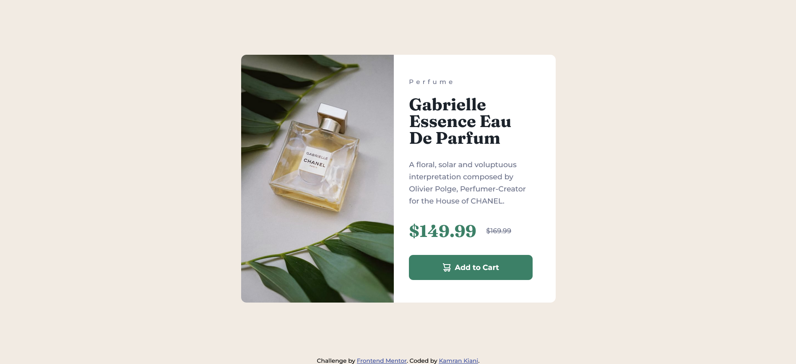

# Frontend Mentor - Product preview card component solution

This is a solution to the [Product preview card component challenge on Frontend Mentor](https://www.frontendmentor.io/challenges/product-preview-card-component-GO7UmttRfa).

## Table of contents

- [Frontend Mentor - Product preview card component solution](#frontend-mentor---product-preview-card-component-solution)
  - [Table of contents](#table-of-contents)
  - [Overview](#overview)
    - [The challenge](#the-challenge)
    - [Screenshot](#screenshot)
    - [Links](#links)
  - [My process](#my-process)
    - [Built with](#built-with)
    - [What I learned](#what-i-learned)
    - [Useful resources](#useful-resources)
  - [Author](#author)

## Overview

### The challenge

Users should be able to:

- View the optimal layout depending on their device's screen size
- See hover and focus states for interactive elements

### Screenshot

### Links

- Solution URL: [Github](https://github.com/kaamiik/Product-preview-card)
- Live Site URL: [Vercel](https://product-preview-card-blue.vercel.app/)

## My process

### Built with

- Semantic HTML5 markup
- CSS custom properties
- Flexbox
- Mobile-first workflow

### What I learned

- Planned my HTML first and use `<picture>` tag for two size images and aalso use `object-fit` property for the size of images.
- Add some info for screen reader users.

### Useful resources

- [Plan my HTML](https://fedmentor.dev/posts/html-plan-product-preview/) - For planning my html i used this resource.

## Author
- Frontend Mentor - [@kaamiik](https://www.frontendmentor.io/profile/kaamiik)

